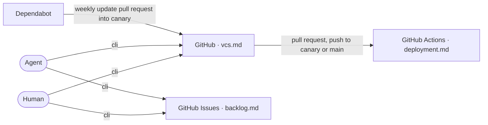

# Ecosystem

```mermaid
flowchart LR
  Human([Human])
  Agent([Agent])
  Vcs["GitHub · vcs.md"]
  Tracker["GitHub Issues · backlog.md"]
  Ci["GitHub Actions · deployment.md"]
  Dependabot["Dependabot"]

  Human -- cli --> Vcs
  Agent -- cli --> Vcs
  Human -- cli --> Tracker
  Agent -- cli --> Tracker
  Vcs -- "pull request, push to canary or main" --> Ci
  Dependabot -- "weekly update pull request into canary" --> Vcs
```
